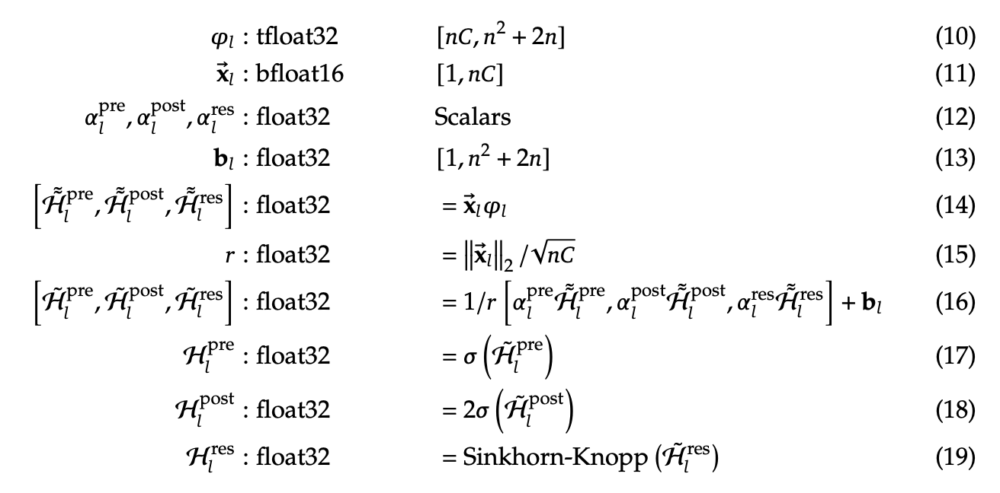

# mHC-Triton

**Manifold-Constrained Hyper-Connections** with fused Triton kernels for efficient training. Refer [blog](https://dev.withnucleus.ai/blog/mhc-triton)

Created by [NucleusAI](https://github.com/WithNucleusAI)

Based on the paper: [Hyper-Connections](https://arxiv.org/html/2512.24880) by the DeepSeek team

## Features

- **Fused Triton kernels** implementing paper's Section 4.3 optimizations
- **6.2x faster** full forward+backward vs PyTorch baseline
- **3.4x overhead** vs simple residual 
- **Full autograd support** for training

## Installation

```bash
pip install git+https://github.com/NucleusAI/mHC-triton.git
```

Or install from source:

```bash
git clone https://github.com/NucleusAI/mHC-triton.git
cd mHC-triton
pip install -e .
```

## Quick Start

```python
import torch
from mhc import HyperConnection

# Create hyper-connection layer
hc = HyperConnection(dim=512, num_streams=4, dynamic=True).cuda()

# Input: hyper-hidden state (batch, seq, num_streams, dim)
H = torch.randn(2, 128, 4, 512, device='cuda')

# Forward pass
branch_input, add_residual = hc(H)

# Your layer (e.g., attention, MLP)
branch_output = your_layer(branch_input)

# Combine with residual streams
H_new = add_residual(branch_output)
```

## Architecture

The hyper-connection module provides:

1. **Pre-mixing**: Combines streams into layer input via learned weights (Eq. 10)
2. **Residual mixing**: Transforms streams via doubly-stochastic matrix (Eq. 11)
3. **Post-distribution**: Routes layer output back to streams (Eq. 12)

```
H (batch, seq, 4, dim)
       │
       ├──► Pre-mix ──► branch_input (batch, seq, dim)
       │                      │
       │                      ▼
       │                 Your Layer
       │                      │
       │                      ▼
       │                branch_output
       │                      │
       └──► Res-mix ──────────┴──► Add ──► H_new (batch, seq, 4, dim)
```

## Optimizations from the Paper

This implementation incorporates the efficiency techniques from Section 4.3 of the mHC paper:

### 1. Fused Dynamic Weight Kernel (Eq. 14-19)

<p align="center">
  
</p>

Instead of separate operations for projection, normalization, and activation, fuse everything into a single kernel:

```
x ──► φ·x ──► RMSNorm ──► Scale+Bias ──► Activations ──► Sinkhorn ──► H_pre, H_post, H_res
      └─────────────────── All in one kernel ───────────────────────┘
```

**Key optimizations:**
- **Transposed φ layout**: The projection matrix φ is stored as `[24, in_dim]` instead of `[in_dim, 24]` for coalesced memory reads. Each output dimension's weights are contiguous in memory.
- **Fused RMSNorm**: The norm `||x||₂/√dim` is computed during the matmul pass, eliminating a separate reduction kernel.
- **Inline Sinkhorn-Knopp**: The doubly-stochastic projection runs inside the same kernel (no separate launch), with the 4×4 matrix kept entirely in registers.

### 2. Register-Based 4×4 Matrices

All 4×4 mixing matrices (H_res, Sinkhorn intermediates) are stored in 16 scalar registers per batch element:

```python
# 16 scalars = 4×4 matrix in registers
m00, m01, m02, m03 = ...
m10, m11, m12, m13 = ...
m20, m21, m22, m23 = ...
m30, m31, m32, m33 = ...
```

This avoids shared memory entirely and enables efficient in-register Sinkhorn iterations.

### 3. Sinkhorn Backward with O(T²) Recomputation

The forward Sinkhorn pass has T iterations, each producing an intermediate matrix. Storing all T matrices would require O(T) memory. Instead, use **recomputation**:

```
Memory: O(1) instead of O(T)
Compute: O(T²) recomputation per backward iteration
```

For T=20 iterations, this trades 20× more compute for 20× less memory—a good trade-off since the matrices are tiny (4×4) and compute is fast.

### 4. Optimized Weight Gradient Reduction

Weight gradients (dH_pre, dH_post, dH_res) require summing over sequence and dimension axes. Use a two-phase approach:

1. **Triton kernel**: Computes partial sums per (batch, seq, dim_block) tile
2. **PyTorch reduction**: Uses optimized `tensor.sum()` for final reduction

This hybrid approach leverages PyTorch's highly-optimized parallel reduction instead of a serial Triton kernel, providing significant speedup for the backward pass.

### 5. Mixed Precision Pipeline

```
BF16/FP16 input ──► FP32 compute ──► FP32 accumulation ──► FP32 output
```

Inputs can be half-precision for memory efficiency, while computation uses FP32 for numerical stability.

## Kernel Overview

| Kernel | Purpose | Optimization |
|--------|---------|--------------|
| `_sinkhorn_kernel` | Project to doubly-stochastic | 4×4 in registers, unrolled iterations |
| `_stream_mix_kernel` | Eq. 10-11: pre-mix + residual mix | Fused dual output, broadcast weights |
| `_add_residual_kernel` | Eq. 12: distribute layer output | Fused multiply-add |
| `_fused_dynamic_weights_kernel` | Eq. 14-19: compute H_pre/post/res | Transposed φ, inline Sinkhorn, fused RMSNorm |
| `_sinkhorn_backward_kernel` | Backward through Sinkhorn | O(T²) recomputation for O(1) memory |
| `_stream_mix_backward_kernel` | Backward through mixing | Partial sums + PyTorch reduction |
| `_add_residual_backward_kernel` | Backward through residual | Partial sums + PyTorch reduction |

## API Reference

### `HyperConnection`

```python
HyperConnection(
    dim: int,              # Hidden dimension
    num_streams: int = 4,  # Number of parallel streams (must be 4)
    layer_idx: int = 0,    # Layer index for initialization
    dynamic: bool = True,  # Use input-dependent weights
    sinkhorn_iters: int = 20,  # Iterations for doubly-stochastic projection
    init_scale: float = 0.1,   # Initial scale for dynamic weight deltas
    use_fused_weights: bool = True,  # Use fused kernel for Eq. 14-19
)
```

### Low-Level Ops

```python
from mhc import sinkhorn_knopp, fused_stream_mix, fused_add_residual, fused_dynamic_weights

# Project to doubly-stochastic matrix
P = sinkhorn_knopp(M, num_iters=20)  # (batch, 4, 4) → (batch, 4, 4)

# Fused stream mixing (Eq. 10-11)
branch_input, H_residual = fused_stream_mix(H, H_pre, H_res)

# Fused residual addition (Eq. 12)
H_new = fused_add_residual(H_residual, branch_output, H_post)

# Fused dynamic weights (Eq. 14-19)
H_pre, H_post, H_res = fused_dynamic_weights(x, phi, bias, alpha_pre, alpha_post, alpha_res)
```

## Performance

Benchmarks on NVIDIA H100 80GB HBM3 (batch=16, seq=2048, dim=4096):

### Speed

| Operation | PyTorch | Triton | Speedup |
|-----------|---------|--------|---------|
| Sinkhorn (20 iter) | 0.74ms | 0.47ms | 1.6x |
| Stream Mix | 8.53ms | 1.00ms | 8.6x |
| Add Residual | 2.57ms | 0.89ms | 2.9x |
| Dynamic Weights | 0.90ms | 0.11ms | 7.9x |
| Full Forward+Backward | 85.00ms | 13.66ms | 6.2x |

### Memory

| Operation | PyTorch | Triton | Savings |
|-----------|---------|--------|---------|
| Sinkhorn Backward | 120.0MB | 68.0MB | 1.8x |
| Full Forward+Backward | 8003.6MB | 6162.8MB | 1.3x |

## Requirements

- Python ≥ 3.9
- PyTorch ≥ 2.0
- Triton ≥ 2.1
- CUDA GPU (optimized for H100)

## Citation

If you use this implementation, please cite the original paper:

```bibtex
@article{deepseek2024hyperconnections,
  title={Hyper-Connections},
  author={DeepSeek Team},
  journal={arXiv preprint arXiv:2512.24880},
  year={2024}
}
```

## License

MIT License
